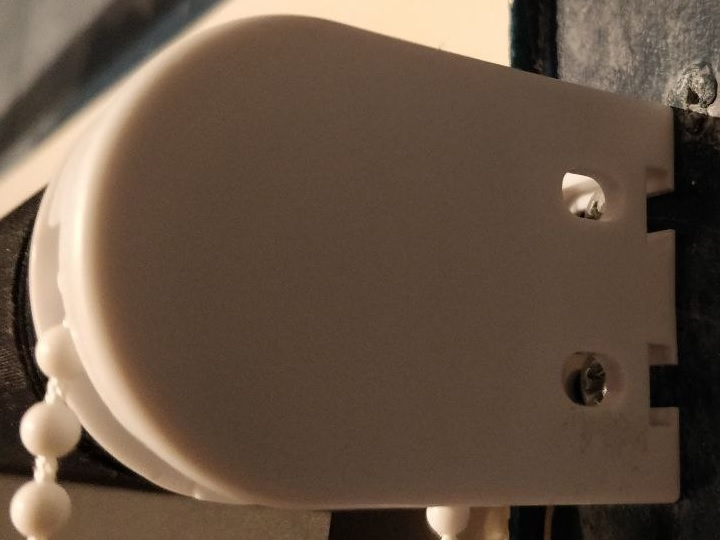
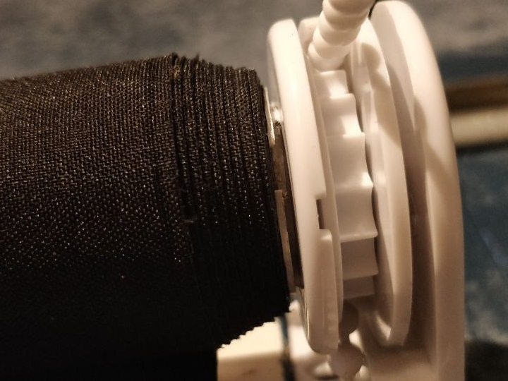

# motor-driven-roller-blind
This project aims to collect the information regarding the building of a motor driven rollerblind. Intention is to use some type of motor, controlled by an mcu, that perhaps connect to a wireless interface as well to be steered by an application. This could for example be tied to an alarm clock, or a light sensor could perhaps be used to control the amount of light entering the room. 

# Roller Blind Information / Stats

|  |  |
|:------------------------------------------------:|:-----------------------------------------------------:|
| *Side view of the roller blind*         | *View from below of the roller blind*                   |

---

To roll the blind a plastic gear is attached to a beaded string which functions like a chain. Attaching a luggage scale and pulling the string down to roll the blind up gave a maximal reading of 1.3 kg (with a mean of about 1.1 kg and a minimum of about 0.9kg). The method of making the measurement can be seen in the gif below.

|  |
|:----------------------------------------------------------------------------------------------------:|

The beaded string is currently attached to a gear approximately 4 cm in diameter, with 16 teeth.  
My initial plan is to connect a motor to a second gear of similar size and attach the string to that gear. This allows me to avoid modifying the existing system, which is already functioning, and still retain the option of manual operation.

Using a larger gear would increase the required torque, demanding a more powerful motor. On the other hand, using a significantly smaller gear may not be practical, as the current gear is already quite small—though it might be worth experimenting with in the future.

For now, let’s assume we choose a gear with a diameter of 4 cm.  
Since torque is defined as:

$$
T = F \cdot R
$$

where $T$ is torque, $F$ is the force, and $R$ is the lever arm (in this case, the gear radius), the radius is:

$$
  R = \frac{4}{2} = 2\,\text{cm} = 0.02\,\text{m}
$$

The torque can now be calculated to:

$$
  T = 12.8 \text{N} * 0.02 \text{m}  = 0.256 \text{N}\text{m} = 25.6 \text{N}\text{cm} 
$$

A lot of times the max torque on the dc motor seems to be given in gram force $\cdot$ cm. With $1 N = 101.9716 gf$
This gives us a T of

$$
  T = 25.6 N \cdot cm \cdot 101.9716 gf / N = 2605.4 gf \dot cm
$$

Give or take with a little extra friction, maybe around $3000 gf \cdot cm$ would be nice.

Now what if it gets stuck?

A very likely scenario is that the roller blind somehow gets stuck on the way up or down, 
When the motor is stalled (can't turn), it draws more current than normal because the back-EMF (Electromotive Force) (which normally limits
current) dissapears. Back electromotive force is the voltage generated by an electronic motor as it rotates. This voltage is the result of Faradays Law of induction, where a rotating coil in a magnetic field induces a voltage. When the motor rotor spins, it creates its own voltage that opposes the original applied voltage. 
The high current causes excessive heat in the motor windings.  
Without the protection - heat builds quickly and can burn the motor coils or damage electronics driving the motor. 

We might need stall detection, current limiting, and some mechanical failsafe. 

The motor driver will probably limit the current, and maybe have thermal shutdown features as well. 

Researching different DC motors - some of them supply an encoder - which gives information about velocity acceleration etc. 
This could be one way of quickly noticing if the blind is stuck and be an extra safe-proof. 

### Key Roller-Blind Specs

- **Blind pulling Force:** $ 1.3 kg * 9.8 m/s^2 = 12.8 N $ 
- **Gear radius:** 4 cm  
- **Number of Gear Gullets/Teeth** 16
- **Bead Diameter on Beaded String** 4.1

### Requirements
- **Bi-directional motor & motor driver**
- **Rotation torque max of atleast**
- **Stall Protection**
- **Current Limiting** 
- **Thermal Shutdown Features**

Can we have a proximity sensor on the edge of the blind - to know which state the blind is in 
is it up or down? 

---
